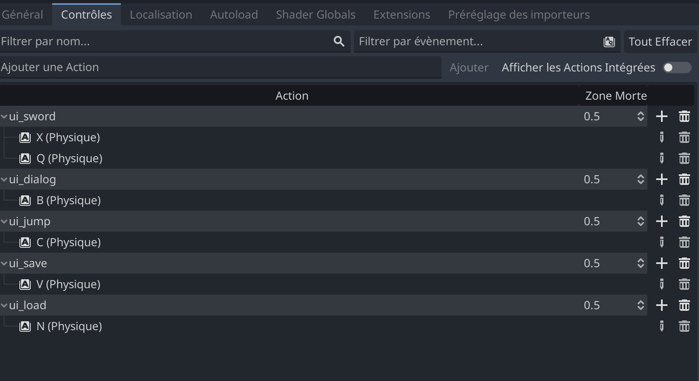

# GODOT ENGINE GAME

## Instructions d'Installation et d'Exécution

Bienvenue dans notre jeu passionnant ! Pour que vous puissiez l'installer et le tester, suivez ces étapes simples :

## Installation

### Prérequis

Assurez-vous d'avoir installé [Godot Engine](https://godotengine.org/) sur votre système.

### Étapes d'Installation

1. Clonez le dépôt du jeu sur votre machine.

	```bash
	   git clone https://github.com/Larbiii-15/godot-4-RBG-2D-Game.git
	```

2. Ouvrez Godot Engine.

3. Cliquez sur "Ouvrir un Projet" et sélectionnez le dossier du jeu que vous venez de cloner.

4. Godot détectera automatiquement le projet et l'ouvrira.

## Configuration



## Exécution

1. Dans Godot, assurez-vous d'avoir sélectionné la scène principale du jeu.

2. Appuyez sur le bouton "Play" (jouer) dans l'interface Godot.

## Touche á utiliser pour jeu au jeu

Lorsque vous êtes prêt à plonger dans l'univers captivant de notre jeu, assurez-vous de maîtriser ces touches pour une expérience de jeu optimale :

# Touches à Utiliser pour Jouer au Jeu

Lorsque vous êtes prêt à plonger dans l'univers captivant de notre jeu, assurez-vous de maîtriser ces touches pour une expérience de jeu optimale :

## Touches de Déplacement :

Utilisez les touches de direction (haut, bas, gauche, droite) pour déplacer votre personnage à travers le monde du jeu.

## Sauter :

Appuyez sur la touche **C** pour permettre à votre personnage de sauter par-dessus les obstacles et atteindre des endroits élevés.

## Attaque avec l'Épée :

Défendez-vous en appuyant sur la touche **X** pour déclencher une attaque fulgurante avec votre épée.

## Ouvrir la Porte :

Lorsque vous êtes devant la maison, appuyez sur la touche **B** pour ouvrir la porte et explorer l'intérieur.

